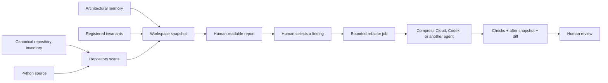

# Complexity Harness

[](https://github.com/Unit237/complexity-harness/actions/workflows/ci.yml)
[](https://www.python.org/)
[](LICENSE)

**Find complexity with evidence. Preserve architectural intent. Give coding agents bounded work.**

Complexity Harness is a dependency-free Python CLI that combines exact
cyclomatic evidence, a canonical repository inventory, architectural memory,
registered invariants, and approval-required refactor jobs.

It was built around one observation:

> AI makes local code generation cheap. It does not automatically make conceptual consolidation cheap.

The expensive failure mode is often not duplicate code. It is **accidental
semantic duplication**: several authorization rules, lifecycle transitions,
session bootstrap behaviors, or recovery policies that independently encode
the same underlying concept.

Cyclomatic complexity can reveal a function worth investigating. Architectural
memory explains why a seemingly simple path may be more dangerous. The harness
keeps those signals separate and inspectable.

## What it does

- Scans one Python repository with exact AST-based branch evidence.
- Scans a multi-repository workspace from a canonical inventory.
- Excludes aliases, duplicate checkouts, generated packages, and build outputs.
- Gives duplicate symbols deterministic, collision-free finding IDs.
- Attaches path-relevant architectural memory and registered invariants.
- Produces JSON snapshots and concise Markdown reports.
- Generates bounded, executor-neutral refactor jobs.
- Blocks agent execution when no verification command is registered.
- Compares before and after snapshots without merging or deploying anything.



## Quick start

```bash
git clone https://github.com/Unit237/complexity-harness.git
cd complexity-harness
python3 -m venv .venv
source .venv/bin/activate
python -m pip install -e ".[dev]"
python -m pytest
```

Or install directly from GitHub:

```bash
python -m pip install "complexity-harness @ git+https://github.com/Unit237/complexity-harness.git"
```

### Scan one repository

```bash
complexity-harness scan . --output /tmp/before.json
complexity-harness validate /tmp/before.json
complexity-harness report /tmp/before.json --top 15
```

Configuration is optional at `.complexity/config.json`:

```json
{
  "cyclomatic_threshold": 12,
  "required_checks": ["python -m pytest"],
  "exclude": ["vendor", "generated"]
}
```

### Scan a canonical workspace

`workspace-scan` automatically looks for `.complexity/repositories.json` and
then `architecture/repositories.json`:

```bash
complexity-harness workspace-scan . --output /tmp/workspace-before.json
complexity-harness validate /tmp/workspace-before.json
complexity-harness report /tmp/workspace-before.json \
  --top 20 \
  --output /tmp/workspace-report.md
```

A minimal inventory looks like this:

```json
{
  "schema_version": "software-repositories-v1",
  "repositories": [
    {
      "id": "api",
      "name": "Product API",
      "path": "services/api",
      "kind": "product",
      "status": "canonical"
    }
  ],
  "aliases": [
    {
      "path": "api-second-checkout",
      "canonical_repository_id": "api"
    }
  ],
  "excluded_paths": [
    "**/.build/**",
    "**/generated/**"
  ]
}
```

Only entries with `status: canonical` are scanned. Repository paths are
resolved inside the workspace root, duplicate IDs and canonical paths fail
closed, and aliases are retained as inventory context without being scanned.

The workspace command also discovers:

- `.complexity/architectural-memory.json` or
  `architecture/architectural-memory.json`;
- `.complexity/invariants.json` or `architecture/invariants.json`.

Explicit paths remain available through `--inventory`, `--memory`, and
`--invariants`.

## Read a finding in context

```bash
complexity-harness context /tmp/workspace-before.json \
  services/api/src/routing.py
```

The result contains matching file metrics, findings, architectural-memory
entries, and registered invariants. This is where a number becomes an
engineering investigation instead of an automatic refactor order.

## Generate a safe refactor job

First choose a finding from the report. Do not automatically choose the
largest number; prefer a hotspot with clear behavior, relevant tests, recent
change pressure, and bounded blast radius.

```bash
complexity-harness refactor-job \
  /tmp/workspace-before.json \
  CYC-EXAMPLE1234 \
  --executor agent-neutral \
  --allow services/api/tests/test_routing.py \
  --check "cd services/api && python -m pytest tests/test_routing.py" \
  --output /tmp/refactor-job.json
```

If no `--check` is supplied and the repository has no configured checks, the
job is generated with `readiness.status: blocked`. That is intentional.

Inspect the envelope, then render the exact prompt for the next agent:

```bash
jq '.readiness, .scope, .registered_invariant_ids, .architectural_memory_ids' \
  /tmp/refactor-job.json

complexity-harness agent-prompt /tmp/refactor-job.json
```

The generated prompt requires the agent to:

1. Read repository instructions, architectural memory, and invariants.
2. Characterize current behavior before editing.
3. Search for analogous hotspots and shared concepts.
4. Stay inside explicit allowed paths.
5. Run every required check and create an after snapshot.
6. Return a draft only—never merge or deploy.

The complete workflow is in the
[agent refactor playbook](docs/agent-refactor-playbook.md).

## Verify the outcome

After the bounded change:

```bash
complexity-harness workspace-scan . --output /tmp/workspace-after.json
complexity-harness diff \
  /tmp/workspace-before.json \
  /tmp/workspace-after.json
```

The delta reports added, removed, and changed files; introduced and resolved
findings; and complexity changes for stable finding IDs. A lower number is not
enough—the required behavioral checks and invariant review must also pass.

## Commands

| Command | Purpose |
|---|---|
| `scan` | Scan one repository. |
| `workspace-scan` | Scan canonical repositories and aggregate their evidence. |
| `validate` | Validate snapshot structure, counts, paths, and unique IDs. |
| `report` | Render a concise Markdown report. |
| `health` | Print machine-readable summary and findings. |
| `context` | Load metrics, memory, and invariants for paths. |
| `impact` | Show snapshot evidence for repeated `--changed` paths. |
| `diff` | Compare files and stable findings before and after. |
| `refactor-job` | Create an approval-required bounded job. |
| `agent-prompt` | Render the job as a prompt for a coding agent. |

Use `complexity-harness <command> --help` for arguments.

## Architectural memory is not a score

Architectural-memory entries record recurring semantic pressure, prior
decisions, evidence paths, and the trigger future work should recognize:

```json
{
  "id": "MEM-AUTH-001",
  "concept": "workspace-authorization",
  "status": "active",
  "summary": "Several routes independently decide the same access rule.",
  "evidence": [
    {"path": "services/api/src/auth.py", "note": "Canonical policy boundary."}
  ],
  "decision": "Route authorization through one policy boundary.",
  "next_trigger": "Any new workspace resource route."
}
```

Cyclomatic findings remain local control-flow evidence. Memory and invariants
remain semantic context. The harness does not collapse them into a universal
maintainability score.

## Registered invariants are executable architecture

The invariant registry is intentionally small. Each entry names an owner and
versioned contract, shows where the rule manifests, records evidence-backed
exceptions, and points to conformance tests:

```json
{
  "id": "INV-AUTH-001",
  "name": "Workspace resource operations require canonical authorization",
  "owner": "shared-platform",
  "version": "workspace-authorization-v1",
  "contract": "architecture/contracts/workspace-authorization-v1.json",
  "status": "enforced",
  "manifestations": [
    {
      "system": "api",
      "path": "services/api/src/workspace_access.py",
      "role": "canonical-policy"
    }
  ],
  "exceptions": [],
  "conformance_tests": ["services/api/tests/test_workspace_access.py"]
}
```

The registry is not a graph database. It is portable JSON that makes an
architectural rule visible to humans, CI, and the next coding agent.

## Safety model

Every generated job is executor-neutral and human-approved:

- explicit allowed paths and a five-file ceiling;
- scope expansion means stop and request review;
- behavior characterization is required;
- before/after snapshots are required;
- missing checks block readiness;
- secrets and destructive migrations are prohibited;
- automatic merge and production deployment are prohibited.

An adapter may submit the envelope to Compress Cloud, Codex, or another agent.
The core never imports an agent SDK or gives the executor broader authority.

## Current support and honest limits

Python cyclomatic analysis is exact and AST-based. JavaScript and TypeScript
repositories still appear in the canonical inventory and report, but their
control-flow metrics are not analyzed yet. A TypeScript analyzer will be added
only with a real parser, branch-evidence fixtures, and cross-runtime gold tests.

The harness also deliberately does **not**:

- infer that the highest CC finding is the best refactor;
- detect semantic duplication from identifiers alone;
- authorize a refactor because a threshold was crossed;
- merge or deploy an agent's work.

## Dogfood result

Across 14 canonical repositories in the Light Reach workspace, the
inventory-aware scan currently analyzes 1,533 Python files and 14,623
functions, attaches eight architectural
memory entries and eleven invariants, and produces 1,096 investigation
candidates at repository-specific thresholds—with zero duplicate IDs and zero
generated or duplicate-checkout leakage.

Those 1,096 findings are **not 1,096 refactor tickets**. They are evidence from
which a human can select a small, testable, architecturally informed job.

## Project docs

- [Agent refactor playbook](docs/agent-refactor-playbook.md)
- [LinkedIn launch kit](docs/linkedin-launch-post.md)
- [Contributing](CONTRIBUTING.md)
- [Security policy](SECURITY.md)
- [Changelog](CHANGELOG.md)

## License

MIT. Built by [Light Reach](https://lightreach.io).
